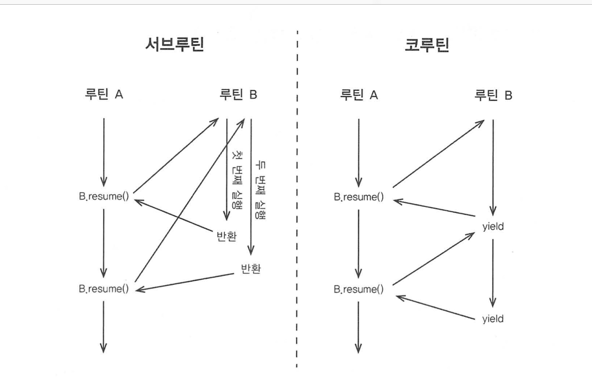

# 코루틴과 Async/Await

## 1. 코루틴이란?

위키피디아 : 코루틴은 컴퓨터 프로그램 구성 요소 중 하나로 비선점형 멀티태스킹(non-preemptive multitasking)을 수행하는
일반화한 서브루틴(subroutine)이다. 코루틴은 일시 중단(suspend)하고 재개(resume)할 수 있는 여러 진입 지점(entry point)을
허용한다.

위 정의를 좀 더 쉽게 표현하면 `코루틴이란 서로 협력해서 실행을 주고 받으면서 작동하는 여러 서브루틴을 말한다.` 이다.

일반적인 함수의 제어 흐름과 코루틴의 제어 흐름은 다음과 같다.



- subroutine
  - 다른 함수를 호출하고 반환하기 때문에 함수의 상태가 저장되지 않는다.
- coroutine
  - 다른 함수를 호출하고 반환하는게 아니라 실행 흐름을 다시 넘겨준다. 덕분에 함수의 상태가 유지된다.

코루틴의 장점은 일반적인 프로그램 로직을 기술하듯 코드를 작성하고 상대편 코루틴에 데이터를 넘겨야 하는 부분에서만 `yield`를 사용하면 되낟.
```
generator countdown(n) {
    while(n>0) {
        yield n // 상대편 코루틴에게 데이터 넘기기
        n-=1 
    }
}

for i in countdown(n) {
    println(i)
}
```

## 2. 코틀린의 코루틴 지원: 일반적인 코루틴

언어가 코루틴을 지원하는 방법은 두 가지다.
1. 제네레이터 등 특정 형태의 코루틴만을 지원
2. 일반적인 코루틴을 만들 수 있는 기능을 언어가 기본 제공하고, 제네레이터, async/await등 다양한 코루틴은 그런 기본 기능을 활용해 사용자가 직접 만들거나 라이브러리로 제공

코틀린은 2번 방식으로 코루틴을 지원한다.

일반적인 코루틴을 만들 수 있는 기능은 1.3부터 코틀린에서 기본으로 제공한다. 특정 형태의 코루틴은 `kotlin-coroutine-core` 라이브러리를
통해 사용 가능하다.

### 여러 가지 코루틴

다음 `coroutine builder`는 `kotlin.coroutine.core` 모듈에 들어있는 `coroutine builder`이다.

- `kotlinx.coroutines.CoroutineScope.launch`
  - 'launch'는 코루틴을 job으로 반환하며, 만들어진 코루틴은 기본적으로 즉시 실행된다.
  - 'launch'가 작동하려면 `CoroutineScope` 객체가 블록의 `this`로 지정돼야 한다.
    - `GlobalScope.launch`가 만들어낸 코루틴은 서로 다른 스레드에서 실행되지만, 메인 스레가 실행 중인 동안만 동작을 보장한다.
  - 'runBlocking()'을 사용하면 코루틴의 실행이 끝날 때까지 현재 스레드를 블록시킨다.
  - 코루틴들은 `yield()`를 통해 서로 협력할 수 있다.
  - `delay()`를 사용한 코루틴은 그 시간이 지날 때까지 다른 코루틴에게 실행을 양보한다.
  
- `kotlinx.coroutines.CoroutineScope.async`
  - `async`는 사실상 `launch`와 같은 일을 한다. 따라서 `launch`대신 `async`를 사용해도 항상 아무 문제 없다.
  - `async`는 `Deffered`를 반환한다.
    - `Deffered`는 `Job`을 상속한다. 차이점은 다음과 같다.
      - `Deffered` 안에는 `await()` 함수가 있다.
      - `Deffered`는 코루틴이 계산하고 돌려주는 값의 타입을 지정할 수 있다.
  - `async`와 스레드 병렬 처리 차이점
    - 스레드를 여럿 사용하는 병렬 처리와 달리 모든 `async` 함수들이 메인 스레드 안에서 실행된다. 그럼에도 불구하고 시간은 스레드 병렬처리와 비슷하다.
    - 위 장점은 실행하려는 작업 시간이 얼마 걸리지 않거나 I/O에 의한 대기 시간이 크고, CPU 코어 수가 작아 동시에 실행할 수 있는 스레드 개수가 한정된 상황에 적합하다.

### 코루틴 컨텍스트와 디스패처

`CoroutineScope`은 실제로 `CoroutineContext`를 `launch`등의 확장 함수에서 사용하기 위한 매개체 역할만 담당한다.
코루틴 실행에는 `CoroutineContext`가 더 중요한 역할을 한다.

`CoroutineContext`는 코루틴이 실행 중인 여러 작업과 디스패처를 저장하는 맵이다. 그리고 코틀린 런타임은 `CoroutineContext`를 사용해
다음 실행할 작업을 선정하고, 어떻게 스레드에 배정할지 대한 방법을 결정한다.

### 코루틴 빌더와 일시 중단 함수

`launch`, `async`, `runBlocking`은 모두 코루틴 빌더다. `kotlin-coroutines-core` 모둘에는 2가지 코루틴 빌더가 더 있다.
- `produce` : 정해진 채널로 데이터를 스트림으로 보내는 코루틴을 만든다.
- `actor` : 정해진 채널로 메시지를 받아 처리하는 액터를 코루틴으로 만든다.

`delay()`, `yield()`는 코루틴 안에서 특별한 의미를 지닌 함수이고, 이런 함수를 일시 중단 함수라고 부른다. `koltin-coroutines-core` 모둘의
최상단에 정의된 일시 중단 함수가 더 존재한다.
- `withContext` : 다른 컨택스트로 코루틴을 전환한다.
- `withTimeout` : 코루틴이 정해진 시간 안에 실행되지 않으면 예외를 발생시킨다.
- `withTimeoutOrNull` : 코루틴이 정해진 시간 안에 실행되지 않으면 `null`을 결과로 돌려준다.
- `awaitAll` : 모든 작업의 성공을 기다린다. 작업 중 어느 하나가 예외로 실패하면 `awaitAll`도 그 예외로 실패한다.
- `joinAll` : 모든 작업이 끝날 때까지 현재 작업을 일시 중단시킨다.

