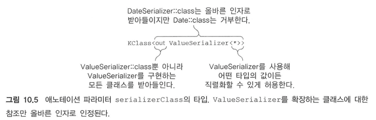

# Chapter10 애노테이션과 리플렉션

## 10.1 애노테이션 선언과 적용

### 10.1.1 애노테이션 적용
- 애노테이션 적용은 자바와 동일하게 @와 이름으로 이루어진 애노테이션을 함수나 클래스 등에 붙이면 된다.
- 인자를 지정할 수 있으며 원시 타입의 값, 문자열, enum, 클래스 참조, 다른 어노태이션, 배열 등이 들어갈 수 있다.
  - 클래스를 인자로 받을 때는 '클래스명 + ::class'로 표기한다.
  - 애노테이션을 인자로 받을 때는 @를 제외한 애노테이션 이름만을 표기한다
  - 배열을 인자로 받을 때는 arrayOf 함수를 호출하여 표기한다.
  - 단, 임의의 프로퍼티는 인자로 지정할 수 없다. -> 애노테이션, 클래스, 함수 등도 들어갈 수 있는데 왜 프로퍼티만 못들어갈까?
```kotlin
@Deprecated("Use descriptKotlinSummary(description) instead.", ReplaceWith("descriptKotlinSummary(description)"))
fun presentKotlinSummary(summary: String) {}

@RequestMapping(path = arrayOf("/foo", "/bar"))
```
- 아래와 같이 intellij quick fix 제시 및 코드 설명


### 10.1.2 애노테이션 대상
- 코틀린 소스코드에서 한 선언을 컴파일한 결과가 <strong>여러 자바 선언과 대응</strong>하는 경우가 자주 있다.
- 이를 해결하기 위해 명확한 대상을 지정하여 선언할 수 있다
- NotNull 적용이 안됐을 때 상황이 이것 때문


### 10.1.4 애노테이션 선언
- annotation keyword를 사용하여 선언할 수 있다.
- 애노테이션의 파라미터가 있으려면 주 생성자를 통해 선언해야 한다
- 생성자의 파라미터는 val로 선언을 해야한다.(var 선언 시 컴파일 오류)
- 자바에서 value 메소드는 특별하게 취급되며 이를 제외한 모든 애트리뷰트는 이름을 명시해야 한다.
```kotlin
annotation class Declaration
    
annotation class DeclarationFirstParamName(val firstParamName: String)
```
```java
public @interface JsonName {
    String value();
}
```
### 10.1.5 메타애노테이션: 애노테이션을 처리하는 방법 제어
- 애노테이션 클래스에 적용할 수 있는 애노테이션을 메타애노테이션이라고 부른다
- 메타애노테이션들은 컴파일러가 애노테이션을 처리하는 방법을 제어한다.
```kotlin
// 가장 흔하게 쓰이는 메타 애노테이션 Target
@Target(AnnotationTarget.PROPERTY) 
annotation class JsonExclude

// 메타애노테이션을 만들고 싶다면 아래와 같이 지정
@Target(AnnotationTarget.ANNOTATION_CLASS)
annotation class BindingAnnotation
```
참고 사항


### 10.1.6 애노테이션 파라미터로 클래스 사용

```kotlin
annotation class ClassAnnotation(val targetClass: KClass<out Any>)

ClassAnnotation(Test::class)
```
### 10.1.7 애노테이션 파라미터로 제네릭 클래스 받기
```kotlin
annotation class GenericClassParameter(val target: KClass<out IndexedValue<*>>)

GenericClassParameter(IndexedValue::class)
```



## 10.2 리플렉션: 실행 시점에 코틀린 객체 내부 관찰
- 코틀린에서 리플렉션을 사용하려면 두 가지 서로 다른 리플렉션 API를 다뤄야 한다.
- 첫 번째는 자바가 java.lang.reflect 패키지를 통해 제공하는 표준 리플렉션
- 두 번째는 코틀린이 kotlin.reflect 패키지를 통해 제공하는 코틀린 리플렉션
  - 자바에는 없는 프로퍼티나 널이 될 수 있는 타입과 같은 코틀린 고유 개념에 대한 리플렉션이다.

### 10.2.1 코틀린 리플렉션 API: KClass, KCallable, KFunction, KProperty
- java.lang.Class에 해당하는 KClass를 사용하면 클래스 안에 있는 모든 선언을 열거하고 각 선언에 접근하거나 클래스의 상위 클래스를 얻는 등의 작업이 가능하다.

```kotlin

class Person(val name: String, val age: Int)

fun printKotlinReflectionApi() {
  val person = Person("Yoo", 32)
  val kClass = person.javaClass.kotlin
  println(kClass.simpleName)
  kClass.members.forEach { println(it.name) }
}
```

- KCallable은 call 메소드를 통해 함수와 프로퍼티를 호출할 수 있다.
- KFuntion를 통해 함수를 호출할 수 있다.
- call 메소드는 타입 안정성을 보장해주지 않기 때문에 invoke를 이용하는 것이 낫다
```kotlin
fun foo(x: Int) = println(x)
fun printFoo() {
  val kFunction = ::foo
  kFunction.call(42)
}

fun sum(x: Int, y: Int) = x + y
fun printSum() {
  val kFunction: KFunction2<Int, Int, Int> = ::sum
  println(kFunction.invoke(1, 2) + kFunction(3, 4))
}
```
- KProperty를 통해 프로퍼티를 호출할 수 있다.
- 최상위 수준이나 클래스 안에 정의된 프로퍼티만 리플렉션으로 접근할 수 있고 함수의 로컬 변수에는 접근할 수 없다
```kotlin
var counter = 0
fun printProperty() {
  val kProperty = ::counter
  kProperty.setter.call(21) // setter 호출
  println(kProperty.get())
}

fun printProperty2() {
  val person = Person("Yoo", 32)
  val memberProperty = Person::age  // 프로퍼티 참조
  println(memberProperty.get(person))   // 참조된 프로퍼티를 get하면 age를 가져올 수 있다.
}
```